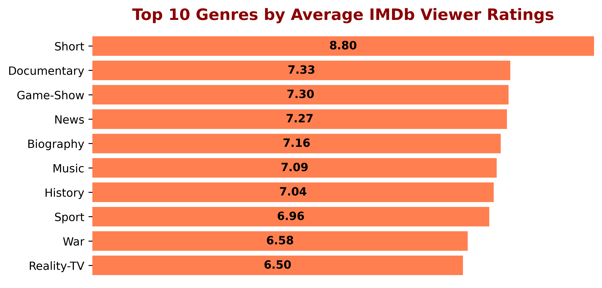
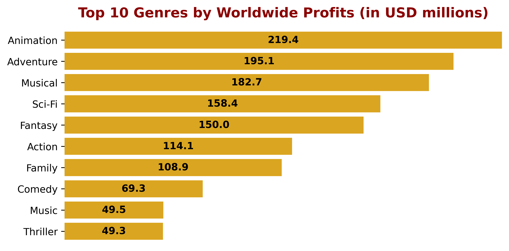
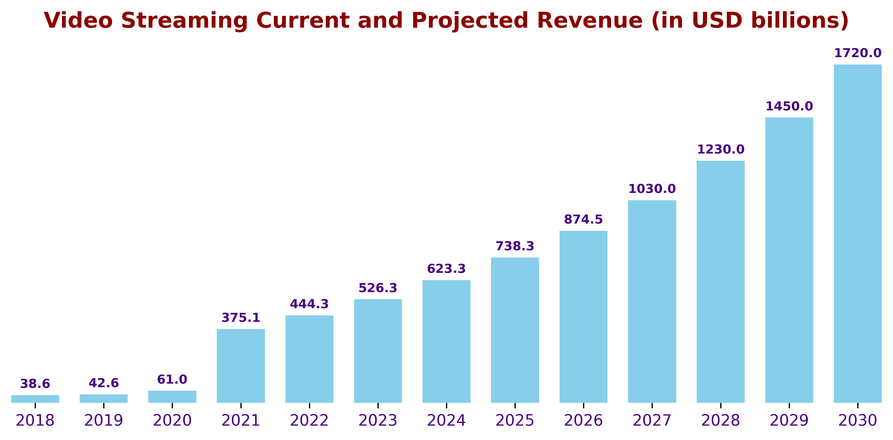

## DAT Phase 1 Project

**Student name: Ravinarayan Raghupathi, MSc PhD**

**Instructor name: Hardik Idnani**

### Overview

#### Business problem
Microsoft wants to launch a new movie studio and needs advice on the most profitable films and video content to create and distribute.
#### The brief:
Microsoft sees all the big companies creating original video content and have decided to create a new movie studio, but they don’t know anything about creating movies or video content. Explore what types of film/video content is currently doing the best at the box office, use exploratory data analysis and translate the findings into actionable insights that the Head of Microsoft's new studio can use to help decide what type of content to create.
#### Conclusions
Microsoft should invest in producing original box office movies in popular culture genres (which tend to return huge profits) and seriously consider launching a subscription video streaming platform wherein they can also produce and showcase content in genres that are highly rated by viewers.

### My strategy
I intend to examine the following key indicators in order to inform Microsoft about their best plan of action for creating movie content:
1. What are the average viewer ratings of movie genres?
2. What are the average worldwide profits by movie genre (taking into account production budgets)?
3. How profitable can it be to invest in setting up a video streaming platform?

**I used the following steps to achieve my outcomes**
### Step1:Create dataframes from the data files that I chose to analyse
Having analysed the .csv files provided in 'zippedData', I chose to use the following files to help me examine the key indicators described above:'imdb.title.basics.csv','imdb.title.ratings.csv' and 'tn.movie_budgets.csv'. Additionally, I created a .csv file ('Streaming_revenue.csv') from readily available online data (https://headphonesaddict.com/video-streaming-statistics/)  to show current and estimated revenues from video streaming platforms (in USD billions).
### Step2:Clean the dataframes
Here I removed unnecessary columns, checked for NaN values and removed them if required, cleaned columns to display the correct numerical values and separated column data as required.
### Step 3:Merge dataframes as required
Here I merged dataframes to analyse Average Viewer Ratings by Genre and to analyse Worldwide Profits by Genre
### Step 4:Data Visualisation
Using Matplotlib, I created some simple yet elegant bar graphs to visualise the relationships between Ratings and Genres, Profits and Genres, and finally the current and projected Revenues from video streaming services and exported the images to the 'Images' folder that I had created.

### Conclusions
#### Key Takeaways
1. The top 10 genres based on average IMDb viewer ratings do not necessarily reflect what is normally seen at the box office. That being said, they are all excellent catgories for online video streaming.
2. The most profitable genres are what one would expect from popular culture.
3. Video streaming revenues show a healthy upward trend.
#### Actionable Insights
Microsoft should:
1. Invest in producing box office movies in genres that are highly profitable, as evidenced from popular culture (e.g., Animation, Adventure, Musical, Science fiction, Fantasy and Action).
2. Seriously consider launching an online video streaming platform, given that worldwide revenues are expected to soar in the next 7 years.
3. Produce content in genres that are very popular amongst viewers for the streaming platform (e.g.,Shorts, Documentaries, Game Shows).